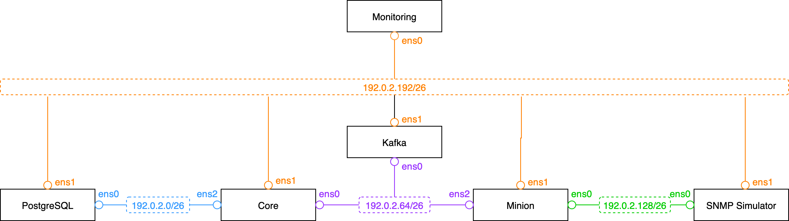

# 👩‍🔬 Benchmark Lab

Running OpenNMS components in various environments and workloads, makes it complicated to size and scale. Especially when you want to size it for extremely large deployments. There are various challenges that make this a complicated task:

External critical service dependencies that OpenNMS relies on and doesn’t fully control. Typical services are:

* PostgreSQL database
    * Apache Kafka for distributed deployments, e.g. Minion and Sentinel or optional
    * Apache Kafka as a northbound integration layer using the kafka-producer
    * Elasticsearch for Flows or Events and Alarm forwarding
    * Underlying storage systems and capabilities
    * Network reliability and latency
* Mixture of different monitoring requirements and applied workloads, e.g. Syslog, Trap reception, Flows, service Monitoring, data collection
* Responsiveness and reliability of the underlying network infrastructure.

This document provides an approach to build a lab environment that can provide some baseline performance metrics per monitoring functionality. The OpenNMS components are mostly deployed in the following scenarios:

* Running on physical hardware, the given hardware specs are critical variables influencing and relate to the base line performance
* Running in virtual environment, the allocation and resource sharing policies + hardware specs influencing heavily the base line performance
* Running in a container environment, the container resource policies + hardware specs influencing heavily the base line measurement. If the nodes running containers run on virtual machines, the factors of resource sharing policies are added.

Efficiently use of hardware resources can be achieved with container deployments but introduce a lot of variables affecting the base line measurement. That makes it hard to predict how much of a workload a given deployment can handle.

This document is providing an approach how we can get some performance baselines for a given target deployment.

## 🎯 Goals

* Provide an Optimal Performance Baseline about the maximum handled SNMP metrics collected from a set of Nodes running Net-SNMP with default settings, through a Minion via Apache Kafka.
* Provide an Optimal Performance Baseline about the maximum of receivable SNMPv2 traps through one Minion via Apache Kafka with default settings.
* Provide an Optimal Performance Baseline about the maximum receivable Syslog messages through one Minion via Apache Kafka with default settings.
* Build a GitHub repository which makes this tasks repeatable with different hardware specifications
* Build a framework where we can add experiments with additional features and allows increasing the complexity
* Deployment of the components can be done using [Ansible OpenNMS](https://github.com/opennms-forge/ansible-opennms) roles on the VM's natively
* If k8s is required, the Core instance could run a single node k8s cluster and  [OpenNMS Helm charts](https://github.com/opennms/helm-charts) can be used. 

## 🧟 Non-Goals

* For the first iteration to build out this environment. We ignore a few parts to reduce complexity and speed up progress and preserve some of these topics for further iterations.
* We would ignore for now workload mixes because of a large set of combinations, e.g. Pollerd + Collectd, Syslog + SNMP Traps, Flows and Traps
* Ignore service outages and network latency to provide a base line as an orientation

## 📐 Lab Design

Efficiently use of hardware resources can be achieved with container deployments but introduce a lot of variables affecting the base line measurement. That makes it hard to predict how much of a workload a given deployment can handle.

### Compute and Storage

This benchmark lab is intended to give you a tool, that allows you to deploy 6 virtual machines.

| Component          | CPU | RAM | Disk | Network       | Description                 |
|:-------------------|:---:|:---:|:----:|:-------------:|:----------------------------|
| OpenNMS Core       | 4   | 8GB | 50GB | 1Gbps (<10ms) | OpenNMS Meridian 2024       |
| PostgreSQL         | 2   | 8GB | 50GB | 1Gbps (<10ms) | PostgreSQL 16               |
| Apache Kafka       | 4   | 8GB | 50GB | 1Gbps (<10ms) | Kafka 3.9.0                 |
| OpenNMS Minion     | 2   | 4GB | 50GB | 1Gbps (<10ms) | Meridian Minion 2024        |
| Net-SNMP Simulator | 4   | 8GB | 50GB | 1Gbps (<10ms) | Net-SNMP Agent              |
| Monitoring         | 2   | 4GB | 50GB | 1Gbps (<10ms) | Prometheus, Jaeger, Grafana |


### ⛓️ Networking



#### Testing network address plan

| Host       | Interface | IP Address       | Default gateway | Description               |
|:-----------|:----------|:-----------------|:----------------|:--------------------------|
| database   | ens0      | `192.0.2.4/26`   | 192.0.2.1       | PostgreSQL database       |
| core       | ens2      | `192.0.2.5/26`   | 192.0.2.1       | Core to PostgreSQL        |
| kafka      | ens0      | `192.0.2.68/26`  | 192.0.2.65      | Kafka Broker              | 
| core       | ens0      | `192.0.2.69/26`  | 192.0.2.65      | Core to Kafka             |
| minion     | ens2      | `192.0.2.70/26`  | 192.0.2.65      | Minion to Kafka           |
| minion     | ens0      | `192.0.2.133/26` | 192.0.2.129     | Minion to SNMP simulator  |
| netsim     | ens0      | `192.0.2.134/26` | 192.0.2.129     | SNMP Simulator            |

| Network      | Gateway Address | Default gateway | Description              |
|:-------------|:----------------|:----------------|:-------------------------|
| 10.42.0.0/16 | `192.0.2.201`   | `192.0.2.129`   | Network with SNMP Agents |

#### Management network address plan

| Host       | Interface | IP Address       | Default gateway | Description               |
|:-----------|:----------|:-----------------|:----------------|:--------------------------|
| database   | ens1      | `192.0.2.196/26` | 192.0.2.193     | PostgreSQL Managament     |
| core       | ens1      | `192.0.2.197/26` | 192.0.2.193     | OpenNMS Core Managament   |
| kafka      | ens1      | `192.0.2.198/26` | 192.0.2.193     | Kafka Broker Managament   |
| minion     | ens1      | `192.0.2.199/26` | 192.0.2.193     | OpenNMS Minion Managament |
| monitoring | ens1      | `192.0.2.200/26` | 192.0.2.193     | Monitoring Managament     |
| netsim     | ens1      | `192.0.2.201/26` | 192.0.2.193     | SNMP Simulator            |

## Configuration

### SNMP Simulator

To simulate a larger set of network agents on the `netsim` Linux host, we can install a local route to a large set of IP addresses.

```bash
ip r a local 10.42.0.0/16 dev lo
```

IPv4 forwarding needs to be enabled
```bash
sudo sysctl -w net.ipv4.ip_forward=1
```
Tha same can be achieved with IPv6 addresses.

```bash
ip -6 route add local 2001:db8:100::/64 dev lo
```

IPv6 address forwarding
```bash
sudo sysctl -w net.ipv6.conf.all.forwarding=1
```

### Minion

To access the 10.42.0.0/16 network a static route needs to be installed.

```bash
sudo ip r a 10.42.0.0/16 via 192.0.2.134
```
## 🕹️ Usage

Export your public SSH key in an enviornment variable SSH_PUBLIC_KEY:

```
export SSH_PUBLIC_KEY=$(cat ~/.ssh/id_rsa.pub)"
```

Deploy the lab in Azure using az cli.

```bash
cd azcli
./benchmark-lab.sh
```

Get the public IP address for SSH to the monitoring server to bootstrap the stack

```bash
cd ansible
vi bootstrap
```

Add you public IP for the `mon ansible_host=""`

Initialize the project files and deploy the stack

```bash
cd ansible
ansible-playbook -i bootstrap site.yaml
```

