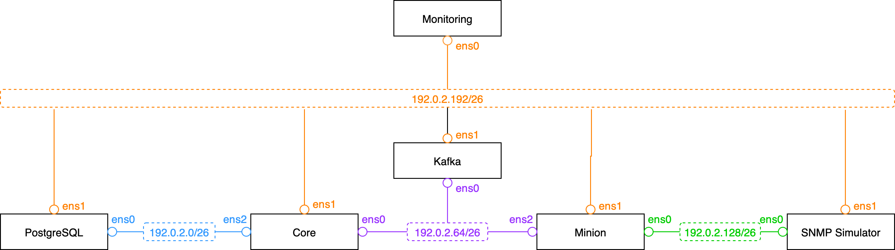

# 👩‍🔬 Benchmark Lab

Running OpenNMS components in various environments and workloads, makes it complicated to size and scale.
Especially when you want to size it for extremely large deployments.
There are various challenges that make this a complicated task:

External service dependencies that OpenNMS relies on and where we don't have control about it:

* Network latency between OpenNMS internal components and the monitored devices
* Agent or network service latency for the services you want to monitor
* Availability of services you want to test or agents you gather insights from your systems

## 🎯 Goals

This repository is an approach to build a lab environment as a tool to build reproducible environments for benchmarking or testing purposes.
There is a [Wiki](https://github.com/opennms-forge/opennms-benchmark/wiki) with a collection of experiments and results.

## 🧟 Non-Goals

* This repository is not intended to deploy or build production environments

## 📐 Lab Design



## ⚙️ Compute and Storage

This benchmark lab deploys 6 virtual machines and wires them in specific way together.

> [!NOTE]
> You need Virtual Machine specifications that can handle at least 3 network interfaces

| Virtual Machine    | Description                  |
|:-------------------|:-----------------------------|
| OpenNMS Core       | OpenNMS Horizon              |
| PostgreSQL         | PostgreSQL                   |
| Apache Kafka       | Kafka with Kafka UI          |
| OpenNMS Minion     | OpenNMS Horizon              |
| Net-SNMP Simulator | Net-SNMP Agent               |
| Monitoring         | Prometheus, Jaeger, Grafana  |

## ⛓️ Networking

With the given network layout we give you good visibility which traffic goes to which service by isolating them.
The network IP space is chosen from the private 192.0.2/24 range which is not public and should reduce IP address conflicts with existing 192.168/16 private networks.

The public address from Azure is assigned to the management network interface of the monitoring VM.

### Network address plan for Testing

| Host       | Interface | IP Address       | Default gateway | Description               |
|:-----------|:----------|:-----------------|:----------------|:--------------------------|
| database   | ens0      | `192.0.2.4/26`   | 192.0.2.1       | PostgreSQL database       |
| core       | ens2      | `192.0.2.5/26`   | 192.0.2.1       | Core to PostgreSQL        |
| kafka      | ens0      | `192.0.2.68/26`  | 192.0.2.65      | Kafka Broker              | 
| core       | ens0      | `192.0.2.69/26`  | 192.0.2.65      | Core to Kafka             |
| minion     | ens2      | `192.0.2.70/26`  | 192.0.2.65      | Minion to Kafka           |
| minion     | ens0      | `192.0.2.133/26` | 192.0.2.129     | Minion to SNMP simulator  |
| netsim     | ens0      | `192.0.2.134/26` | 192.0.2.129     | SNMP Simulator            |

### Network address plan for out of band management

| Host       | Interface | IP Address       | Default gateway | Description               |
|:-----------|:----------|:-----------------|:----------------|:--------------------------|
| database   | ens1      | `192.0.2.196/26` | 192.0.2.193     | PostgreSQL Managament     |
| core       | ens1      | `192.0.2.197/26` | 192.0.2.193     | OpenNMS Core Managament   |
| kafka      | ens1      | `192.0.2.198/26` | 192.0.2.193     | Kafka Broker Managament   |
| minion     | ens1      | `192.0.2.199/26` | 192.0.2.193     | OpenNMS Minion Managament |
| monitoring | ens1      | `192.0.2.200/26` | 192.0.2.193     | Monitoring Managament     |
| netsim     | ens1      | `192.0.2.201/26` | 192.0.2.193     | SNMP Simulator            |


### Network for simulation 

| Network      | Gateway Address | Default gateway | Description              |
|:-------------|:----------------|:----------------|:-------------------------|
| 10.42.0.0/16 | `192.0.2.201`   | `192.0.2.129`   | Network with SNMP Agents |

## 🕹️ Usage

### Clone the repository with submodules

```
git clone https://github.com/opennms-forge/opennms-benchmark.git
cd opennms-benchmark
git submodule init
git submodule update
```

### Lab deployment in Azure

Requirements:
* az cli tool
* Azure login with permissions to use a subscription

Login to Azure with your account:

```bash
az login
```

Deploy the lab

```bash
cd azcli
./benchmark-lab.sh
```
> [!NOTE]
> The network security policy will allow only SSH access to the monitoring VM from your public IP address.

> [!TIP]
> To get access to every node without dealing with Bastion hosts or anything like that, the easiest way is to use something like [tailscale](https://tailscale.com) on the monitoring VM.
> It allows you very easily to route the whole 192.0.2.0/24 through the monitoring VM and makes it transparently available to your machine.

Here is how you can do it:

Step 1: Enable IPv4 forwarding on the monitoring VM

```
ssh azureuser@<public-ip>
sudo sysctl -w net.ipv4.ip_forward=1
```

Step 2: Install Tailscale from your account

Step 3: Advertise the 192.0.2.0/24 network

```bash
sudo tailscale up --accept-routes --advertise-routes=192.0.2.192/26
```

Step 4: Approve the advertised route in the Tailscale web UI


Step 5: Verify connectivity

```bash
ping -c 1 192.0.2.196
ping -c 1 192.0.2.197
ping -c 1 192.0.2.198
ping -c 1 192.0.2.199
ping -c 1 192.0.2.200
ping -c 1 192.0.2.201
```

### Tools for Measurements

To monitor the components we are using Prometheus, the Node Exporter, Kafka Web UI and Grafana.
You can deploy the components with Ansible using

```bash
cd bootstrap
ansible-playbook -i inventory site.yml
```

### Deploy the OpenNMS Stack

OpenNMS Core, Minion and Kafka will be installed using our existing [Ansible OpenNMS](https://github.com/opennms-forge/ansible-opennms) roles.

> [!NOTE]
> The Ansible playbook for OpenNMS is linked as submodule in this repository so you don't have to deal with a dedicated repository.

Deploy a generic OpenNMS application stack

```bash
cd ansible-opennms
ansible-playbook --user azureuser --become -i ../ansible-inventory.yml opennms-playbook.yml --extra-vars="@../opennms-lab-vars.yml"
```
> [!IMPORTANT]
> The Prometheus JMX exporter requires right now to restart Core manually, see [issue#57](https://github.com/opennms-forge/ansible-opennms/issues/57).

### Setup SNMP Simulation

Add a local any IP route on the SNMP simulation VM to respond to any address in the 10.42/16 network
```bash
ssh azureuser@192.0.2.201 "sudo ip route add local 10.42.0.0/16 dev lo"
```

Add a route on the Minion to reach any address in 10.42.0.0 via the SNMP simulation VM
```bash
ssh azureuser@192.0.2.199 "sudo ip r a 10.42.0.0/16 via 192.0.2.134"
```

> [!IMPORTANT]
> The routing entries are not static, you have to set them again when your reboot the virtual machines
 
### Applications

You have now access to the following applications and you can prepare and run experiments.

* Grafana with login admin/admin: http://192.0.2.200:3000
* OpenNMS Web UI login admin/admin: http://192.0.2.197:8980
* Jaeger no login required: http://192.0.2.200:16686
* Kafka UI no login required: http://192.0.2.198:8080
