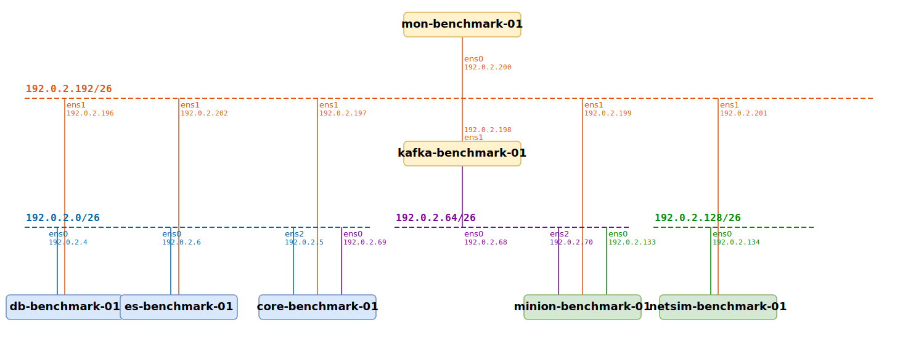

# 👩‍🔬 Benchmark Lab

Running OpenNMS components in various environments and workloads, makes it complicated to size and scale.
Especially when you want to size it for extremely large deployments.
There are various challenges that make this a complicated task:

External service dependencies that OpenNMS relies on and where we don't have control about it:

* Network latency between OpenNMS internal components and the monitored devices
* Agent or network service latency for the services you want to monitor
* Availability of services you want to test or agents you gather insights from your systems

## 🎯 Goals

This repository is an approach to build a lab environment as a tool to build reproducible environments for benchmarking or testing purposes.
There is a [Wiki](https://github.com/opennms-forge/opennms-benchmark/wiki) with a collection of experiments and results.

## 🧟 Non-Goals

* This repository is not intended to deploy or build production environments

## 📐 Lab Design



## ⚙️ Requirements

The lab deploys 7 virtual machines. Each VM needs at least 2 NICs (management + one functional subnet); Core and Minion need 3.

### Compute

Default VM sizes map to Azure SKUs. For other providers (KVM, Proxmox, VMware) you set these values directly in the provider's `.tfvars`.

| VM | Role | Azure size | vCPU | RAM |
|:---|:-----|:-----------|-----:|----:|
| `db-benchmark-01` | PostgreSQL | `Standard_B2ms` | 2 | 8 GB |
| `core-benchmark-01` | OpenNMS Core (8 GB JVM heap) | `Standard_B4ms` | 4 | 16 GB |
| `kafka-benchmark-01` | Apache Kafka + Kafka UI | `Standard_B2ms` | 2 | 8 GB |
| `minion-benchmark-01` | OpenNMS Minion | `Standard_B2ms` | 2 | 8 GB |
| `netsim-benchmark-01` | SNMP Simulator (l8opensim) | `Standard_B2ms` | 2 | 8 GB |
| `mon-benchmark-01` | Monitoring stack (Prometheus, Grafana, Jaeger, …) | `Standard_B2ms` | 2 | 8 GB |
| `es-benchmark-01` | Elasticsearch | `Standard_B2ms` | 2 | 8 GB |
| **Total** | | | **16** | **64 GB** |

### Storage

OS disk sizes below are the defaults used by the non-Azure Terraform providers. Azure provisions the Ubuntu 24.04 LTS image default (~30 GB) unless overridden.

| VM | OS disk |
|:---|--------:|
| `db-benchmark-01` | 50 GB |
| `core-benchmark-01` | 100 GB |
| `kafka-benchmark-01` | 50 GB |
| `minion-benchmark-01` | 20 GB |
| `netsim-benchmark-01` | 20 GB |
| `mon-benchmark-01` | 30 GB |
| `es-benchmark-01` | 50 GB |
| **Total** | **320 GB** |

### Network

The lab uses four isolated subnets inside `192.0.2.0/24` plus one DHCP/public interface on the monitoring VM. Only the monitoring VM requires a publicly routable IP.

| Subnet | CIDR | Purpose |
|:-------|:-----|:--------|
| Management | `192.0.2.192/26` | Operator SSH, Ansible, out-of-band access to all VMs |
| Database | `192.0.2.0/26` | PostgreSQL and Elasticsearch traffic |
| Kafka | `192.0.2.64/26` | Kafka broker, OpenNMS IPC (Core ↔ Kafka ↔ Minion) |
| Simulation | `192.0.2.128/26` | SNMP simulation (Minion ↔ NetSim, `10.42.0.0/16` route) |

**Inbound firewall rules required on the monitoring VM:**

| Port | Protocol | Source | Purpose |
|-----:|:---------|:-------|:--------|
| 22 | TCP | operator CIDR | SSH access |
| 443 | TCP | operator CIDR | HTTPS (Traefik — all web UIs) |

All inter-VM communication stays on the internal subnets and requires no additional inbound rules.

## ⛓️ Networking

With the given network layout we give you good visibility which traffic goes to which service by isolating them.
The network IP space is chosen from the private 192.0.2/24 range which is not public and should reduce IP address conflicts with existing 192.168/16 private networks.

### Network address plan for Testing

| Host       | Interface | IP Address       | Default gateway | Description               |
|:-----------|:----------|:-----------------|:----------------|:--------------------------|
| database   | ens0      | `192.0.2.4/26`   | 192.0.2.1       | PostgreSQL database       |
| core       | ens2      | `192.0.2.5/26`   | 192.0.2.1       | Core to PostgreSQL        |
| elasticsearch | ens0   | `192.0.2.6/26`   | 192.0.2.1       | Elasticsearch             |
| kafka      | ens0      | `192.0.2.68/26`  | 192.0.2.65      | Kafka Broker              |
| core       | ens0      | `192.0.2.69/26`  | 192.0.2.65      | Core to Kafka             |
| minion     | ens2      | `192.0.2.70/26`  | 192.0.2.65      | Minion to Kafka           |
| minion     | ens0      | `192.0.2.133/26` | 192.0.2.129     | Minion to SNMP simulator  |
| netsim     | ens0      | `192.0.2.134/26` | 192.0.2.129     | SNMP Simulator            |

### Network address plan for out of band management

| Host       | Interface | IP Address       | Default gateway | Description               |
|:-----------|:----------|:-----------------|:----------------|:--------------------------|
| database   | ens1      | `192.0.2.196/26` | 192.0.2.193     | PostgreSQL Managament     |
| core       | ens1      | `192.0.2.197/26` | 192.0.2.193     | OpenNMS Core Managament   |
| kafka      | ens1      | `192.0.2.198/26` | 192.0.2.193     | Kafka Broker Managament   |
| minion     | ens1      | `192.0.2.199/26` | 192.0.2.193     | OpenNMS Minion Managament |
| monitoring | ens1      | `192.0.2.200/26` | 192.0.2.193     | Monitoring Managament     |
| netsim     | ens1      | `192.0.2.201/26` | 192.0.2.193     | SNMP Simulator            |
| elasticsearch | ens1   | `192.0.2.202/26` | 192.0.2.193     | Elasticsearch Management  |


### Network for simulation

| Network      | Gateway Address | Default gateway | Description              |
|:-------------|:----------------|:----------------|:-------------------------|
| 10.42.0.0/16 | `192.0.2.201`   | `192.0.2.129`   | Network with SNMP Agents |

## 🕹️ Usage

### Clone the repository with submodules

```bash
git clone https://github.com/opennms-forge/opennms-benchmark.git
cd opennms-benchmark
git submodule init
git submodule update
```

## 🚀 Lab Deployment

The lab is deployed using Terraform. Four providers are supported: **Azure**, **KVM/libvirt**, **Proxmox VE**, and **VMware vSphere**.

All providers share a common `terraform/lab.tfvars` for network layout, IP addresses, and VM names. Each provider adds its own `<provider>.tfvars` for host-specific settings.

### Azure

**Requirements:** `az` CLI, Azure subscription with contributor access, Terraform ≥ 1.5

**1. Authenticate**

```bash
az login
```

**2. Configure**

Edit `terraform/azure/azure.tfvars` and set your values:

```hcl
location       = "eastus"
environment    = "prod"
project_name   = "benchmark"
vm_size_small  = "Standard_B2ms"
vm_size_medium = "Standard_B4ms"
priority       = "Regular"       # or "Spot" for cheaper preemptible VMs
operator_cidr  = "203.0.113.5/32" # your public IP — SSH access is restricted to this
ssh_key_path   = "~/.ssh/id_rsa"
```

> [!NOTE]
> `operator_cidr` controls the NSG rule that allows SSH to the monitoring VM. Set it to your public IP in CIDR notation (e.g. `"203.0.113.5/32"`). Leave it empty to allow SSH from anywhere (not recommended).

**3. Deploy**

```bash
./deploy.sh --provider azure
```

The script detects your public IP automatically and passes it as `operator_cidr`. It runs `terraform init` and `terraform apply`, then bootstraps the VMs and deploys the full OpenNMS stack. The monitoring VM receives a public IP — all other VMs are accessible only through the management network.

---

### KVM/libvirt

**Requirements:** KVM host with libvirtd running, Terraform ≥ 1.5, Ubuntu 24.04 LTS cloud image

See [`terraform/kvm/README.md`](terraform/kvm/README.md) for full documentation including remote host deployment and multi-host Terraform workspaces.

**0. Create the external bridge (`br0`)** on the KVM host

The monitoring VM gets its public IP via a bridge to your LAN. Create `br0` using Netplan on the KVM host (Ubuntu 24.04):

```bash
sudo tee /etc/netplan/01-br0.yaml > /dev/null <<'EOF'
network:
  version: 2
  ethernets:
    enp1s0:
      dhcp4: false
  bridges:
    br0:
      interfaces: [enp1s0]
      dhcp4: true
      parameters:
        stp: false
        forward-delay: 0
EOF
sudo netplan apply
```

> [!NOTE]
> Replace `enp1s0` with your actual interface name (`ip link` to check). After `netplan apply` your host's IP moves to `br0` — SSH sessions may drop briefly.

**1. Download the Ubuntu 24.04 cloud image** onto the KVM host

```bash
sudo wget -O /var/lib/libvirt/images/noble-server-cloudimg-amd64.img \
  https://cloud-images.ubuntu.com/noble/current/noble-server-cloudimg-amd64.img
```

**2. Ensure the default storage pool is active**

```bash
virsh pool-list --all
virsh pool-start default   # if inactive
```

**3. Configure**

```bash
cp terraform/kvm/kvm.tfvars.example terraform/kvm/kvm.tfvars
```

Edit `kvm.tfvars` and set `libvirt_uri`:

| Target | URI |
|--------|-----|
| Local KVM daemon | `qemu:///system` |
| Remote KVM host  | `qemu+ssh://user@your-kvm-host/system` |

`kvm.tfvars` is gitignored — your local settings are never committed.

**4. Deploy**

```bash
./deploy.sh --provider kvm
```

The script runs `terraform init` and `terraform apply`, then automatically discovers the monitoring VM's external DHCP address (via SSH through the hypervisor) and re-applies to regenerate the Ansible inventory with the correct `jump_host`. It then bootstraps the VMs and deploys the full OpenNMS stack.

---

### Proxmox VE

**Requirements:** Proxmox VE host, API token with VM.Allocate permissions, Terraform ≥ 1.5

**1. Create the Ubuntu 24.04 cloud-init template** (one-time setup on the Proxmox host)

```bash
# Download the cloud image on the Proxmox host
wget https://cloud-images.ubuntu.com/noble/current/noble-server-cloudimg-amd64.img

# Create the template VM
qm create 9000 --name ubuntu-24.04-cloud --memory 2048 --cores 2 --net0 virtio,bridge=vmbr0
qm importdisk 9000 noble-server-cloudimg-amd64.img local-lvm
qm set 9000 --scsihw virtio-scsi-pci --scsi0 local-lvm:vm-9000-disk-0
qm set 9000 --ide2 local-lvm:cloudinit
qm set 9000 --serial0 socket --vga serial0
qm set 9000 --boot c --bootdisk scsi0
qm set 9000 --ipconfig0 ip=dhcp
qm template 9000
```

**2. Configure Proxmox bridges** in the Proxmox UI under *Node > Network*:

| Bridge   | Subnet            | Description                             |
|:---------|:------------------|:----------------------------------------|
| `vmbr0`  | 192.0.2.192/26    | Management — operator SSH access        |
| `vmbr1`  | 192.0.2.0/26      | Database subnet                         |
| `vmbr2`  | 192.0.2.64/26     | Kafka subnet                            |
| `vmbr3`  | 192.0.2.128/26    | SNMP simulation subnet                  |
| `vmbr4`  | external (DHCP)   | Monitoring VM external routable IP      |

**3. Configure**

```bash
cp terraform/proxmox/proxmox.tfvars.example terraform/proxmox/proxmox.tfvars
```

Edit `proxmox.tfvars` with your values:

```hcl
proxmox_endpoint     = "https://192.168.1.10:8006/"
proxmox_api_token    = "user@realm!token-name=00000000-0000-0000-0000-000000000000"
proxmox_insecure     = false   # set true for self-signed certificates
proxmox_ssh_username = "root"
proxmox_node         = "pve"
template_vm_id       = 9000
storage_pool         = "local-lvm"
snippets_datastore   = "local"
ssh_key_path         = "~/.ssh/id_rsa"
```

`proxmox.tfvars` is gitignored — your credentials are never committed.

**4. Deploy**

```bash
./deploy.sh --provider proxmox
```

The script runs `terraform init` and `terraform apply`, then automatically discovers the monitoring VM's external DHCP address on `vmbr4` (via SSH through the Proxmox host) and re-applies to regenerate the Ansible inventory with the correct `jump_host`. It then bootstraps the VMs and deploys the full OpenNMS stack.

---

### VMware vSphere

**Requirements:** vCenter Server, account with VM create/clone permissions, Terraform ≥ 1.5, [`govc`](https://github.com/vmware/govmomi/tree/main/govc) (optional, for OVA import)

See [`terraform/vmware/README.md`](terraform/vmware/README.md) for full documentation including cloud-init delivery via guestinfo and network interface naming.

**1. Create port groups** on a vSwitch or dvSwitch in the vSphere UI:

| Variable | Purpose | Subnet |
|:---------|:--------|:-------|
| `pg_mgmt` | Management — static IPs, operator SSH | `192.0.2.192/26` |
| `pg_db` | Database traffic between Core and PostgreSQL | `192.0.2.0/26` |
| `pg_kafka` | Kafka coordination (Core, Kafka, Minion) | `192.0.2.64/26` |
| `pg_sim` | SNMP simulation network (Minion ↔ NetSim) | `192.0.2.128/26` |
| `pg_ext` | External DHCP — monitoring VM gets a routable IP here | _(DHCP)_ |

Internal port groups (`pg_db`, `pg_kafka`, `pg_sim`) carry only lab traffic and do not require uplinks. `pg_mgmt` and `pg_ext` need uplinks for operator SSH access.

**2. Build a template VM** (one-time setup)

```bash
# Import Ubuntu 24.04 cloud image OVA
govc import.ova noble-server-cloudimg-amd64.ova

# Boot the VM and install required packages
apt install -y open-vm-tools cloud-init

# Generalize — clear cloud-init state before converting to template
cloud-init clean --logs
sudo shutdown -h now
```

In the vSphere UI, right-click the VM → **Convert to Template**. The template name must match `template_name` in `vmware.tfvars`.

**3. Configure**

```bash
cp terraform/vmware/vmware.tfvars.example terraform/vmware/vmware.tfvars
```

Edit `vmware.tfvars` with your values:

```hcl
vsphere_server   = "vcenter.example.com"
vsphere_user     = "administrator@vsphere.local"
vsphere_password = ""                            # or set TF_VAR_vsphere_password
vsphere_insecure = false                         # set true for self-signed certificates
datacenter       = "dc1"
cluster          = "cluster1"
datastore        = "datastore1"
template_name    = "ubuntu-2404-cloud-init"
ssh_key_path     = "~/.ssh/id_rsa"
pg_mgmt          = "PG-LAB-MGMT"
pg_db            = "PG-LAB-DB"
pg_kafka         = "PG-LAB-KAFKA"
pg_sim           = "PG-LAB-SIM"
pg_ext           = "PG-LAB-EXT"
```

`vmware.tfvars` is gitignored — your credentials are never committed.

**4. Deploy**

```bash
./deploy.sh --provider vmware

# With a self-signed vCenter certificate:
./deploy.sh --provider vmware --tf-args "-var vsphere_insecure=true"
```

The script runs `terraform init` and `terraform apply`, then automatically discovers the monitoring VM's external DHCP address on `pg_ext` and re-applies to regenerate the Ansible inventory with the correct `jump_host`. It then bootstraps the VMs and deploys the full OpenNMS stack.

---

### Tools for Measurements

To monitor the components we are using Prometheus, the Node Exporter, Kafka Web UI and Grafana.
You can deploy the components with Ansible using

```bash
cd bootstrap
ansible-playbook -i inventory site.yml
```

### Deploy the OpenNMS Stack

OpenNMS Core, Minion and Kafka will be installed using our existing [Ansible OpenNMS](https://github.com/opennms-forge/ansible-opennms) roles.

> [!NOTE]
> The Ansible playbook for OpenNMS is linked as submodule in this repository so you don't have to deal with a dedicated repository.

Deploy a generic OpenNMS application stack

```bash
cd ansible-opennms
ansible-playbook --user labuser --become -i ../ansible-inventory.yml opennms-playbook.yml --extra-vars="@../opennms-lab-vars.yml"
```
> [!IMPORTANT]
> The Prometheus JMX exporter requires right now to restart Core manually, see [issue#57](https://github.com/opennms-forge/ansible-opennms/issues/57).

### Applications

All applications are served by Traefik on the monitoring VM's public IP over HTTPS.
Replace `<monitoring-public-ip>` with the actual public IP assigned to the monitoring VM.

> [!NOTE]
> Traefik uses a self-signed certificate. Your browser will show a certificate warning — accept it to proceed.

| Application          | URL                                         | Credentials                 |
|:---------------------|:--------------------------------------------|:----------------------------|
| OpenNMS UI           | `https://<monitoring-public-ip>/opennms`    | admin / admin               |
| Grafana              | `https://<monitoring-public-ip>/grafana`    | admin / admin               |
| Prometheus           | `https://<monitoring-public-ip>/prometheus` | no login required           |
| Jaeger               | `https://<monitoring-public-ip>/jaeger`     | no login required           |
| Kafka UI             | `https://<monitoring-public-ip>/kafka`      | no login required           |
| pgAdmin              | `https://<monitoring-public-ip>/pgadmin`    | admin@benchmark.lab / admin |
| Kibana               | `https://<monitoring-public-ip>/kibana`     | no login required           |
| SNMP Sim (l8opensim) | `https://<monitoring-public-ip>/opensim`    | no login required           |

> [!TIP]
> To reach every VM on the management network (`192.0.2.192/26`) without a bastion host, install [Tailscale](https://tailscale.com) on the monitoring VM and advertise the subnet:
>
> ```bash
> # On the monitoring VM
> sudo sysctl -w net.ipv4.ip_forward=1
> sudo tailscale up --accept-routes --advertise-routes=192.0.2.192/26
> ```
>
> Then approve the advertised route in the Tailscale web UI. Once active, all lab VMs are reachable directly from your local machine.
