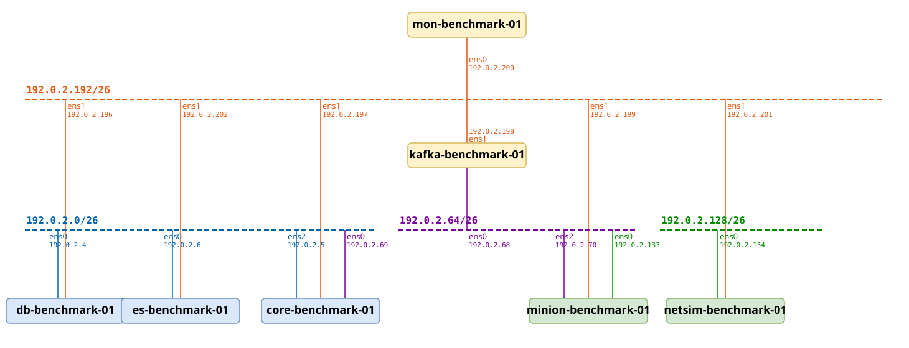

# 👩‍🔬 Benchmark Lab


Sizing and scaling [OpenNMS](https://www.opennms.com/) is hard because the environment dominates the numbers: network latency between components, agent latency on the monitored side, and the availability of realistic load sources.
This repository builds reproducible lab environments so those variables are controlled instead of guessed.

Terraform provisions the VMs, Ansible configures them, and experiments drive measured load against the result.
Results and experiment write-ups live in the [Wiki](https://github.com/opennms-forge/opennms-benchmark/wiki).

> [!IMPORTANT]
> This lab is a benchmarking tool. It is not intended to deploy or build production environments.

## 📐 Lab Design



Three axes combine into one lab run:

| Axis | Question it answers | Where it lives |
|:-----|:--------------------|:---------------|
| **Provider** | Where do the VMs run? | `terraform/<provider>/` |
| **Deployment** | What topology is under test? | `deployments/<slug>/` |
| **Experiment** | What workload is driven against it? | `experiments/<name>/` |

`make` is the front door for everything.
CI calls the same targets, so do not invoke `terraform` or `ansible-playbook` directly.
`make help` lists all targets.

## 🚀 Quick Start (KVM)

Prerequisites: a KVM host with `libvirtd` running, and on your workstation Terraform ≥ 1.5, Ansible, and Python 3.

One-time workstation setup:

```bash
ansible-galaxy collection install -r bootstrap/requirements.yml
export ANSIBLE_VAULT_PASSWORD_FILE=$PWD/vault_pass.secret   # file containing the lab vault password
```

The deploy installs the OpenNMS stack collections from the root `requirements.yml` itself, but the bootstrap collections and the vault password are your job.
Provisioning uses the SSH key at `ssh_key_path` in the provider `.tfvars` (default `~/.ssh/id_rsa`), so point it at an existing keypair.

**1. Create the external bridge (`br0`) on the KVM host.**
The monitoring VM gets its routable IP via a bridge to your LAN.
On Ubuntu 24.04 with Netplan:

```bash
sudo tee /etc/netplan/01-br0.yaml > /dev/null <<'EOF'
network:
  version: 2
  ethernets:
    enp1s0:
      dhcp4: false
  bridges:
    br0:
      interfaces: [enp1s0]
      dhcp4: true
      parameters:
        stp: false
        forward-delay: 0
EOF
sudo netplan apply
```

Replace `enp1s0` with your interface name (`ip link`).
After `netplan apply` the host IP moves to `br0`, so SSH sessions may drop briefly.

**2. Ensure the default storage pool is active.**

```bash
virsh pool-list --all
virsh pool-start default   # if inactive
```

Terraform fetches the Ubuntu 24.04 cloud image from `cloud-images.ubuntu.com` by default.
To use a local copy, download it onto the KVM host and point `ubuntu_cloud_image` in `kvm.tfvars` at the file.

**3. Configure.**

```bash
cp terraform/kvm/kvm.tfvars.example terraform/kvm/kvm.tfvars
```

Set `libvirt_uri` in `kvm.tfvars`: `qemu:///system` for a local daemon, or `qemu+ssh://user@your-kvm-host/system` for a remote host.
`kvm.tfvars` is gitignored, so your local settings are never committed.

**4. Deploy.**

```bash
make deploy PROVIDER=kvm DEPLOYMENT=baseline
```

This provisions the VMs, discovers the monitoring VM's DHCP address, regenerates the Ansible inventory with the correct jump host, bootstraps the base tooling (Docker, Traefik, Prometheus, Grafana, Jaeger, nl6), deploys the full OpenNMS stack, and publishes the `lab-endpoints.yml` manifest that experiments consume.

Tear down with:

```bash
make destroy PROVIDER=kvm      # prompts; add CONFIRM=yes to skip
```

For multi-host workspaces and remote-host details see [`terraform/kvm/README.md`](terraform/kvm/README.md).

## 🧪 Run an Experiment

The deployment is the system under test; the experiment is the workload.
List both, then run one:

```bash
make deployments                # topology specs with descriptions
make experiments                # runnable workloads
make experiment EXPERIMENT=smoke DEPLOYMENT=baseline
```

`DEPLOYMENT` layers the topology's variable overlay onto the experiment.
Available experiments include `smoke`, `pm-snmp`, `fm-syslog`, `fm-snmptrap`, and `fm-snmptrap-capacity`.
See [`experiments/README.md`](experiments/README.md) for how experiments consume the generated inventory and the `lab-endpoints.yml` manifest, and [`deployments/README.md`](deployments/README.md) for the topology spec format.

> [!NOTE]
> The `DEPLOYMENT` topology axis shapes provisioning on `kvm` and `aws`.
> The other providers deploy the baseline topology.

## ☁️ Providers

Five providers are supported.
All share `terraform/lab.tfvars` for network layout and VM names; each adds its own `<provider>.tfvars` for host-specific settings.
The `kvm`, `aws`, `proxmox` and `vmware` `.tfvars` files are gitignored, so credentials never land in git.
`terraform/azure/azure.tfvars` is tracked; keep secrets out of it (Azure authentication comes from `az login`).

| Provider | `PROVIDER=` | Notes |
|:---------|:------------|:------|
| KVM/libvirt | `kvm` | Reference provider, consumes `DEPLOYMENT` specs |
| AWS | `aws` | Consumes `DEPLOYMENT` specs; statically verified only so far ([#174](https://github.com/opennms-forge/opennms-benchmark/issues/174)) |
| Azure | `azure` | Fixed baseline topology |
| Proxmox VE | `proxmox` | Fixed baseline topology |
| VMware vSphere | `vmware` | Fixed baseline topology |

### Azure

Requirements: `az` CLI, a subscription with contributor access, Terraform ≥ 1.5.

```bash
az login
```

Edit `terraform/azure/azure.tfvars`:

```hcl
location       = "eastus"
environment    = "prod"
project_name   = "benchmark"
vm_size_small  = "Standard_B2ms"
vm_size_medium = "Standard_B4ms"
priority       = "Regular"        # or "Spot" for cheaper preemptible VMs
ssh_key_path   = "~/.ssh/id_rsa"
```

```bash
make deploy PROVIDER=azure
```

The deploy detects your public IP (via the `host` utility) and restricts SSH on the monitoring VM to it (`operator_cidr`).
If detection fails the Azure NSG falls back to allowing SSH and HTTPS from anywhere, so verify the rule after deploy.
Only the monitoring VM receives a public IP; every other VM is reachable through the management network.

### AWS

Requirements: `aws` CLI, Terraform ≥ 1.5, and an `AWS_PROFILE` (the deploy refuses to run against default credentials).

```bash
cp terraform/aws/aws.tfvars.example terraform/aws/aws.tfvars
aws login                       # or aws configure sso / aws configure
aws sts get-caller-identity     # confirm you are signed in
AWS_PROFILE=<your-profile> make deploy PROVIDER=aws DEPLOYMENT=baseline
```

The default `cost_profile=smoke` deploys cheap instances for pipeline validation; numbers from it are not benchmark results.
Use `TF_ARGS="-var cost_profile=benchmark"` for measurement-grade instances.
See [`terraform/aws/README.md`](terraform/aws/README.md) for credentials details, the optional scoped `benchmark-lab` IAM role (`docs/aws-iam/`), cost tables, and current limitations.

### Proxmox VE

Requirements: a Proxmox VE host, an API token with VM.Allocate permissions, Terraform ≥ 1.5.

**1. Create the Ubuntu 24.04 cloud-init template** (one-time, on the Proxmox host):

```bash
wget https://cloud-images.ubuntu.com/noble/current/noble-server-cloudimg-amd64.img
qm create 9000 --name ubuntu-24.04-cloud --memory 2048 --cores 2 --net0 virtio,bridge=vmbr0
qm importdisk 9000 noble-server-cloudimg-amd64.img local-lvm
qm set 9000 --scsihw virtio-scsi-pci --scsi0 local-lvm:vm-9000-disk-0
qm set 9000 --ide2 local-lvm:cloudinit
qm set 9000 --serial0 socket --vga serial0
qm set 9000 --boot c --bootdisk scsi0
qm set 9000 --ipconfig0 ip=dhcp
qm template 9000
```

**2. Create the bridges** in the Proxmox UI under *Node > Network*:

| Bridge | Subnet | Purpose |
|:-------|:-------|:--------|
| `vmbr0` | `192.0.2.192/26` | Management |
| `vmbr1` | `192.0.2.0/26` | Database |
| `vmbr2` | `192.0.2.64/26` | Kafka |
| `vmbr3` | `192.0.2.128/26` | SNMP simulation |
| `vmbr4` | external (DHCP) | Monitoring VM routable IP |

**3. Configure and deploy:**

```bash
cp terraform/proxmox/proxmox.tfvars.example terraform/proxmox/proxmox.tfvars
# edit endpoint, API token, node, template_vm_id, storage pools, ssh_key_path
make deploy PROVIDER=proxmox
```

### VMware vSphere

Requirements: vCenter Server, an account with VM create/clone permissions, Terraform ≥ 1.5, optionally [`govc`](https://github.com/vmware/govmomi/tree/main/govc) for OVA import.

**1. Create port groups** (`pg_mgmt`, `pg_db`, `pg_kafka`, `pg_sim`, `pg_ext`) matching the subnet plan above.
Internal port groups carry only lab traffic and need no uplinks; `pg_mgmt` and `pg_ext` do.

**2. Build a template VM** from the Ubuntu 24.04 cloud image with `open-vm-tools` and `cloud-init` installed, run `cloud-init clean --logs`, shut it down, and convert it to a template named to match `template_name`.

**3. Configure and deploy:**

```bash
cp terraform/vmware/vmware.tfvars.example terraform/vmware/vmware.tfvars
# edit vCenter endpoint, credentials, datacenter/cluster/datastore, template and port group names
make deploy PROVIDER=vmware

# With a self-signed vCenter certificate:
make deploy PROVIDER=vmware TF_ARGS="-var vsphere_insecure=true"
```

See [`terraform/vmware/README.md`](terraform/vmware/README.md) for cloud-init delivery via guestinfo and interface naming.

## ⚙️ Sizing (baseline topology)

The baseline deployment provisions 7 VMs.
Each role carries a size class in the topology spec; what a class resolves to (vCPU, RAM, instance type, disk) is provider-specific.
`make deployment DEPLOYMENT=baseline` prints the resolved spec; disk sizes for the non-Azure providers live in `terraform/disk-sizes.tfvars`.

| VM | Role | Size class | NICs |
|:---|:-----|:-----------|-----:|
| `db-benchmark-01` | PostgreSQL | small | 2 |
| `core-benchmark-01` | OpenNMS Core | xlarge | 3 |
| `kafka-benchmark-01` | Apache Kafka + Kafka UI | small | 2 |
| `minion-benchmark-01` | OpenNMS Minion | small | 3 |
| `netsim-benchmark-01` | SNMP simulator (nl6) | small | 2 |
| `mon-benchmark-01` | Monitoring stack (Prometheus, Grafana, Jaeger, …) | small | 2 |
| `es-benchmark-01` | Elasticsearch | large | 2 |

## ⛓️ Network

The lab isolates traffic on four subnets inside `192.0.2.0/24`, the RFC 5737 TEST-NET-1 documentation range, chosen to avoid conflicts with common `192.168.0.0/16` home and office networks.
Only the monitoring VM gets a routable IP; it is the SSH jump host and the Traefik entry point for every web UI.

| Subnet | CIDR | Purpose |
|:-------|:-----|:--------|
| Management | `192.0.2.192/26` | Operator SSH, Ansible, out-of-band access to all VMs |
| Database | `192.0.2.0/26` | PostgreSQL and Elasticsearch traffic |
| Kafka | `192.0.2.64/26` | Kafka broker, OpenNMS IPC (Core ↔ Kafka ↔ Minion) |
| Simulation | `192.0.2.128/26` | SNMP simulation (Minion ↔ NetSim, `10.42.0.0/16` route) |

Inbound rules required on the monitoring VM: `22/tcp` (SSH jump host) and `443/tcp` (Traefik HTTPS), both restricted to the operator's CIDR.
All inter-VM traffic stays on the internal subnets.

> [!WARNING]
> Per-host addresses are provider-dependent ([#161](https://github.com/opennms-forge/opennms-benchmark/issues/161)).
> Never hardcode a VM address; read the generated `ansible-inventory.yml` instead.

The Minion listens on two ingestion ports for simulated load: SNMP traps on `10162/udp` and UDP syslog (RFC 5424) on `10514/udp`.
The nl6 simulator on the netsim VM emits nothing by default; each experiment creates its own devices, protocols and rates through the nl6 API.

## 🕹️ Applications

All applications are served by Traefik on the monitoring VM's public IP over HTTPS.
Replace `<monitoring-public-ip>` with the monitoring VM's address from the generated `ansible-inventory.yml`.

> [!NOTE]
> Traefik uses a self-signed certificate; accept the browser warning to proceed.
> Routes exist only for components the deployment includes: on a topology without Core, Kafka UI or nl6, those paths return 404.

| Application | URL | Credentials |
|:------------|:----|:------------|
| Landing page (app starter) | `https://<monitoring-public-ip>/` | no login required |
| OpenNMS UI | `https://<monitoring-public-ip>/opennms` | admin / admin |
| Grafana | `https://<monitoring-public-ip>/grafana` | admin / admin |
| Prometheus | `https://<monitoring-public-ip>/prometheus` | no login required |
| Jaeger | `https://<monitoring-public-ip>/jaeger` | no login required |
| Kafka UI | `https://<monitoring-public-ip>/kafka` | no login required |
| pgAdmin | `https://<monitoring-public-ip>/pgadmin` | admin@benchmark.lab / admin |
| Kibana | `https://<monitoring-public-ip>/kibana` | no login required |
| SNMP Sim (nl6) | `https://<monitoring-public-ip>/nl6` | no login required |

> [!IMPORTANT]
> The Prometheus JMX exporter currently requires a manual Core restart after deploy, see [ansible-opennms#57](https://github.com/opennms-forge/ansible-opennms/issues/57).

> [!TIP]
> To reach every VM on the management network without hopping through the jump host, install [Tailscale](https://tailscale.com) on the monitoring VM and advertise the subnet:
>
> ```bash
> sudo sysctl -w net.ipv4.ip_forward=1
> sudo tailscale up --accept-routes --advertise-routes=192.0.2.192/26
> ```
>
> Approve the advertised route in the Tailscale web UI, and all lab VMs are reachable directly from your machine.

## 📖 Further Reading

- [`docs/architecture.md`](docs/architecture.md) — the four-layer pipeline in detail
- [`docs/deployment-guide.md`](docs/deployment-guide.md) — step-by-step deployment reference
- [`docs/development-guide.md`](docs/development-guide.md) — contributing, linting, conventions
- [`deployments/README.md`](deployments/README.md) — topology spec format and validation
- [`experiments/README.md`](experiments/README.md) — experiment contract and layout
- [Wiki](https://github.com/opennms-forge/opennms-benchmark/wiki) — experiments and results
