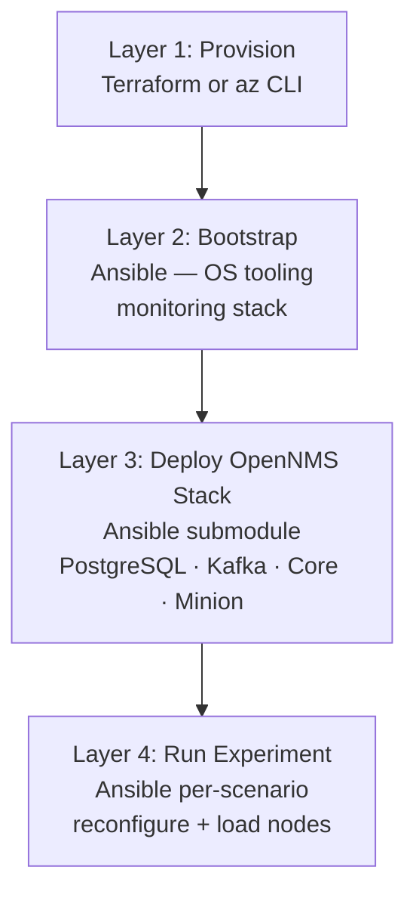
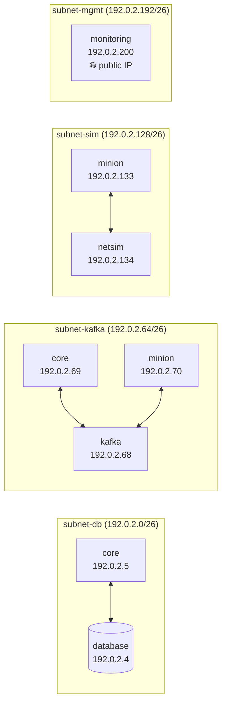
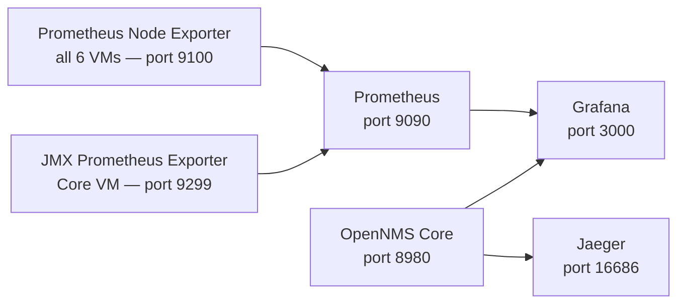

# Architecture

## Executive Summary

The opennms-benchmark project is an infrastructure-as-code (IaC) benchmarking lab for [OpenNMS Horizon](https://www.opennms.com/). It provisions a 6-VM lab on Azure or KVM/libvirt and runs reproducible performance experiments against an OpenNMS stack monitoring up to 10,000 simulated SNMP nodes.

The lab isolates each OpenNMS component on a dedicated VM and connects them through purpose-specific subnets, so that network traffic to and from each service can be measured independently. Experiments swap the OpenNMS configuration (timeseries backend, message broker strategy, monitored load type) while keeping the infrastructure identical, producing comparable benchmark results.

## Architecture Pattern

A four-layer pipeline where each layer is independently runnable and re-runnable:



## VM Layout

Six VMs, each dedicated to one component:

| VM | Management IP | Role |
|---|---|---|
| database | 192.0.2.196 | PostgreSQL 15+ |
| core | 192.0.2.197 | OpenNMS Horizon Core |
| kafka | 192.0.2.198 | Apache Kafka (KRaft mode) + Kafka UI |
| minion | 192.0.2.199 | OpenNMS Minion (distributed collector) |
| netsim | 192.0.2.134 | Net-SNMP simulator (10.42.0.0/16 loopback) |
| monitoring | 192.0.2.200 | Prometheus · Grafana · Jaeger (jump host) |

All VMs run Ubuntu 24.04 LTS. The monitoring VM is the only VM with a public IP address.

## Network Architecture

Four isolated /26 subnets within the 192.0.2.0/24 space (RFC 5737 TEST-NET-3). Each subnet carries traffic for one logical concern, making it straightforward to observe latency at each hop.



### SNMP Simulation Network

The netsim VM responds to SNMP requests for 10.42.0.0/16 (up to 65,534 addresses) by binding that range to the loopback interface:

```bash
ip route add local 10.42.0.0/16 dev lo
```

The minion VM reaches simulation targets via a static route through netsim:

```bash
ip route add 10.42.0.0/16 via 192.0.2.134
```

**Note:** These routes are not persistent across reboots. The Terraform cloud-init module adds this route for the minion VM automatically on first boot, but the netsim loopback route is set by the `net-snmp` Ansible role and must be re-applied after a reboot if the VM is bounced without re-running bootstrap.

## Technology Stack

| Category | Technology | Version | Notes |
|---|---|---|---|
| IaC | Terraform | >= 1.5 | No state backend (local only) |
| Cloud provider | Azure (`azurerm`) | ~> 3.0 | Location: eastus |
| Hypervisor provider | libvirt (`dmacvicar/libvirt`) | ~> 0.7.0 | For KVM/local deployments |
| Legacy provisioning | Azure CLI (`az`) | any | `azcli/benchmark-lab.sh` — reference only |
| Configuration management | Ansible | any recent | Includes Prometheus community collection |
| VM OS | Ubuntu 24.04 LTS | cloud image | Cloud-init enabled |
| OpenNMS | OpenNMS Horizon | 34.1.0 (default) | Configurable per experiment |
| Message broker | Apache Kafka | KRaft mode | No ZooKeeper |
| Database | PostgreSQL | 15+ | Configured via ansible-opennms submodule |
| Observability | Prometheus | latest | Scrapes node (9100) + Core JMX (9299) |
| Dashboards | Grafana OSS | latest | Pre-provisioned dashboards + OpenNMS plugin |
| Tracing | Jaeger | latest | All-in-one; traces OpenNMS internals |
| SNMP simulation | Net-SNMP (`snmpd`) | any | Loopback routing for 10.42.0.0/16 |
| Container runtime | Docker Engine CE | any | Used for Prometheus, Grafana, Jaeger, Kafka UI |
| CI/CD | GitHub Actions | — | Terraform fmt, validate, TFLint on PR |

## Dual Provider Design

The same 6-VM lab deploys to two target environments using one shared variable file (`terraform/lab.tfvars`):

- **Azure** (`terraform/azure/`) — cloud deployment, uses Proximity Placement Groups for low NIC-to-NIC latency, operator SSH restricted to a single CIDR.
- **KVM/libvirt** (`terraform/kvm/`) — local deployment on a single hypervisor host, requires Ubuntu 24.04 cloud image pre-downloaded to the libvirt storage pool.

Provider-specific values live in `azure.tfvars` and `kvm.tfvars` respectively. Shared network, IP, and VM naming values live in `lab.tfvars`.

The `terraform/modules/inventory` module is shared by both providers and generates the Ansible inventory file (`ansible-inventory.yml`) as a Terraform output.

## Cloud-Init

All VMs receive a cloud-init payload generated by `terraform/modules/cloud-init`. It configures:

- Admin user, SSH authorized key, passwordless sudo
- `/etc/hosts` with all 6 lab hostnames
- Static IP addressing via Netplan (no DHCP)
- Extra static routes (e.g., 10.42.0.0/16 on the minion)

This makes VMs immediately reachable by hostname within the lab and SSH-able by Ansible without further configuration.

## OpenNMS Stack

The `ansible-opennms/` submodule deploys and configures:

- **PostgreSQL** — primary datastore for OpenNMS events, alarms, and assets
- **Apache Kafka (KRaft)** — message bus between Core and Minion (IPC strategy)
- **OpenNMS Core** — collects from all nodes, writes to PostgreSQL and timeseries backend; exports JMX metrics via Prometheus JMX exporter on port 9299
- **OpenNMS Minion** — deployed at `lab-location-01`, collects SNMP/syslog/traps from simulated nodes and forwards to Core via Kafka

Global configuration lives in `opennms-lab-vars.yml`. Experiments override specific variables in their own `opennms-lab-vars.yml`.

## Experiments

Each experiment directory is a self-contained Ansible playbook that reconfigures the OpenNMS stack for a specific scenario without reprovisioning VMs.

| Experiment | Broker | Timeseries | Load Type |
|---|---|---|---|
| `c1km1_4c16g_kfk_pm_snmp` | Kafka | OSGI (default) | SNMP polling |
| `c1km1_4c16g_kfk_snmptraps` | Kafka | OSGI (default) | SNMP traps |
| `c1km1_4c16g_kfk_syslog` | Kafka | OSGI (default) | Syslog ingestion |
| `c1km1_4c16g_rrd_pm_snmp` | Kafka | RRD (jrrd2) | SNMP polling |

**Naming convention:** `c<cores>km<minions>_<cpu>c<ram>g_<broker>_<load-type>`

## Observability Stack

All three observability services run as Docker Compose services on the monitoring VM:



Pre-provisioned Grafana dashboards:

- Node Exporter host metrics (all VMs)
- OpenNMS Minion internals
- OpenNMS Core JVM (via JMX exporter)
- Prometheus self-metrics

## CI/CD

GitHub Actions runs on every pull request touching `terraform/**`:

| Job | What it does |
|---|---|
| Format Check | `terraform fmt -check -recursive terraform/` |
| Validate (Azure) | `terraform init -backend=false && terraform validate` |
| Validate (KVM) | `terraform init -backend=false -upgrade && terraform validate` |
| TFLint | Lints both `terraform/azure/` and `terraform/kvm/` with `--minimum-failure-severity=error` |

No apply or plan jobs run in CI — the lab is deployed manually.

## Key Design Decisions

**Static IPs everywhere.** All VM IPs are hardcoded in `lab.tfvars` and propagated through Terraform outputs, cloud-init, Ansible inventory, and OpenNMS variables. This eliminates DNS dependency and makes the lab fully reproducible.

**Proximity Placement Groups (Azure).** All Azure VMs are placed in the same PPG to minimize network latency between NICs — essential for valid benchmark measurements.

**Kafka KRaft mode.** No ZooKeeper dependency. Kafka acts as the IPC bus between Core and Minion for all experiment scenarios, even the RRD timeseries experiment (which only changes the timeseries backend, not the message transport).

**Submodule for OpenNMS Ansible roles.** The `ansible-opennms/` submodule keeps OpenNMS deployment logic upstream and versioned separately from lab-specific configuration. Lab configuration is injected via `opennms-lab-vars.yml` overrides.

**Monitoring VM as jump host.** Only the monitoring VM has a public IP. All other VMs are accessible only through the management subnet. Tailscale is recommended for transparent access to the full 192.0.2.0/24 range from a local machine.
