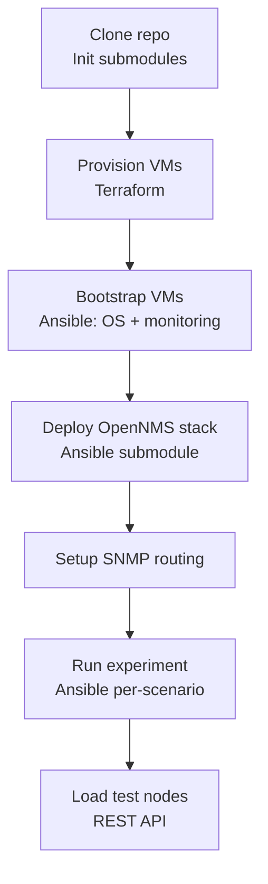

# Deployment Guide

This guide walks through a complete lab deployment from a fresh clone to a running OpenNMS stack ready for experiments. Choose your target environment: [Azure](#azure-deployment) or [KVM/local](#kvmlocal-deployment).

## Deployment Overview



## Azure Deployment

### 1. Authenticate

```bash
az login
```

### 2. Configure variables

Edit `terraform/azure/azure.tfvars`:

```hcl
operator_cidr = "YOUR_PUBLIC_IP/32"  # Restricts SSH access to the monitoring VM
```

Set your SSH key:

```bash
export TF_VAR_ssh_public_key=$(cat ~/.ssh/id_rsa.pub)
```

### 3. Provision VMs

```bash
cd terraform/azure
terraform init
terraform apply -var-file=../lab.tfvars -var-file=azure.tfvars
```

Terraform creates: resource group, proximity placement group, VNet, 4 subnets, NICs (with static IPs), NSG (SSH from operator CIDR only), public IP for monitoring, 6 Ubuntu 24.04 VMs, and writes `ansible-inventory.yml` to the project root.

### 4. Verify SSH access

```bash
ssh labuser@<monitoring-public-ip>
```

If you have Tailscale available, set it up now (see [Network Access](./development-guide.md#network-access-to-the-lab)) to simplify access to all VMs.

### 5. Bootstrap all VMs

From the project root:

```bash
cd bootstrap
ansible-playbook -i inventory site.yml
```

This installs: base packages, Docker Engine, Prometheus Node Exporter, Grafana, Prometheus, Jaeger, Kafka UI, and Net-SNMP simulator.

### 6. Deploy the OpenNMS stack

```bash
cd ansible-opennms
ansible-playbook --user labuser --become \
  -i ../ansible-inventory.yml \
  opennms-playbook.yml \
  --extra-vars="@../opennms-lab-vars.yml"
```

> **Important:** After deployment, restart OpenNMS Core manually on the core VM to activate the JMX Prometheus exporter:
> ```bash
> ssh labuser@192.0.2.197 "sudo systemctl restart opennms"
> ```

### 7. Verify services

| Service | URL |
|---|---|
| OpenNMS UI | `http://192.0.2.197:8980/opennms` |
| Grafana | `http://192.0.2.200:3000` |
| Jaeger | `http://192.0.2.200:16686` |
| Kafka UI | `http://192.0.2.198:8080` |
| Prometheus | `http://192.0.2.200:9090` |

Default credentials: OpenNMS and Grafana both use `admin / admin`.

---

## KVM/Local Deployment

### Prerequisites — KVM host setup

These steps are one-time host configuration required before `terraform apply`. They must be run directly on the KVM host (or over a console session, not SSH, because the bridge setup will briefly renegotiate the network).

#### Create the `br0` bridge

The `lab-external` libvirt network uses `mode = "bridge"` and attaches to `br0` on the host. This bridge must exist before Terraform runs — libvirt does not create host bridges, it only attaches to them.

**Step 1 — identify your physical uplink:**

```bash
ip link show
```

Note the interface name (commonly `enp2s0`, `ens3`, `eth0`). Substitute it in the config below.

**Step 2 — create `/etc/netplan/01-br0.yaml`:**

```yaml
network:
  version: 2
  renderer: networkd
  ethernets:
    enp2s0:           # replace with your actual uplink name
      dhcp4: false    # bridge takes the IP, not the physical NIC
  bridges:
    br0:
      interfaces: [enp2s0]
      dhcp4: true     # bridge gets an IP from your external network
      parameters:
        stp: false    # no spanning tree — VMs attach without delay
        forward-delay: 0
```

If the KVM host uses a static IP, replace the `br0` block with:

```yaml
    br0:
      interfaces: [enp2s0]
      dhcp4: false
      addresses: [192.168.1.10/24]
      routes:
        - to: default
          via: 192.168.1.1
      nameservers:
        addresses: [1.1.1.1, 8.8.8.8]
      parameters:
        stp: false
        forward-delay: 0
```

**Step 3 — apply safely:**

`netplan try` applies the config and auto-reverts after 120 seconds unless confirmed. Use this when applying over SSH — if the bridge fails to come up, the session recovers automatically:

```bash
sudo netplan try
# Confirm once SSH is still reachable:
# Accept changes [yes]:
```

**Step 4 — verify:**

```bash
ip link show br0          # should show state UP
ip addr show br0          # should have an IP address
bridge link show          # enp2s0 should appear as a bridge member
```

> **NetworkManager note:** If NetworkManager is managing your interfaces, either use `nmcli` to create the bridge or disable NM in favour of systemd-networkd before applying the netplan config:
> ```bash
> sudo systemctl disable --now NetworkManager
> sudo systemctl enable --now systemd-networkd systemd-resolved
> ```

### 1. Prepare the cloud image

```bash
sudo wget -O /var/lib/libvirt/images/noble-server-cloudimg-amd64.img \
  https://cloud-images.ubuntu.com/noble/current/noble-server-cloudimg-amd64.img
```

Verify the libvirt storage pool is active:

```bash
virsh pool-list --all
virsh pool-start default   # if inactive
```

### 2. Set your SSH key

```bash
export TF_VAR_ssh_public_key=$(cat ~/.ssh/id_rsa.pub)
```

### 3. Provision VMs

```bash
cd terraform/kvm
terraform init
terraform apply -var-file=../lab.tfvars -var-file=kvm.tfvars
```

### 4–7. Follow steps 5–7 from the Azure deployment

The Ansible and OpenNMS steps are identical. Use `ubuntu` as the admin user instead of `labuser` when SSHing into KVM VMs.

---

## Running an Experiment

After the stack is deployed, select an experiment and run it:

```bash
cd experiments/c1km1_4c16g_kfk_pm_snmp

ansible-playbook -i opennms-lab-inventory.yml experiment.yml \
  --extra-vars="@../../opennms-lab-vars.yml"
```

If the experiment has its own variable overrides (e.g., `c1km1_4c16g_rrd_pm_snmp`):

```bash
ansible-playbook -i opennms-lab-inventory.yml experiment.yml \
  --extra-vars="@../../opennms-lab-vars.yml" \
  --extra-vars="@opennms-lab-vars.yml"
```

## Loading Test Nodes

```bash
cd experiments/inventory

# Import batches 01 through 10 (1,000 nodes each = 10,000 total)
for batch in 01 02 03 04 05 06 07 08 09 10; do
  ./provisioning.sh $batch
done
```

Nodes are added to OpenNMS at location `lab-location-01` and assigned ICMP and SNMP monitoring services.

## Updating or Rerunning

### Update OS packages

```bash
cd bootstrap
ansible-playbook -i ../ansible-inventory.yml update-playbook.yml
```

### Switch to a different experiment

Simply run the new experiment's playbook. It reconfigures OpenNMS Core and Minion without reprovisioning VMs.

### Tear down

```bash
./deploy.sh --provider azure --destroy
./deploy.sh --provider kvm --destroy
```

This runs `terraform destroy` with the correct tfvars and removes the generated `ansible-inventory.yml`. All VMs, NICs, disks, and network resources are deleted. The libvirt networks (`lab-mgmt`, `lab-db`, etc.) are also removed for KVM.

## Post-Reboot Checklist

After rebooting any VM, check and re-apply these ephemeral settings:

| VM | Action |
|---|---|
| snmpsim | `sudo ip route add local 10.42.0.0/16 dev lo` |
| minion | `sudo ip route add 10.42.0.0/16 via 192.0.2.134` |
| monitoring | Re-enable IP forwarding if using Tailscale routing |

The Terraform cloud-init module applies the minion route on first boot only. Subsequent reboots require the manual command above (or re-running the `net-snmp` Ansible role for snmpsim).
